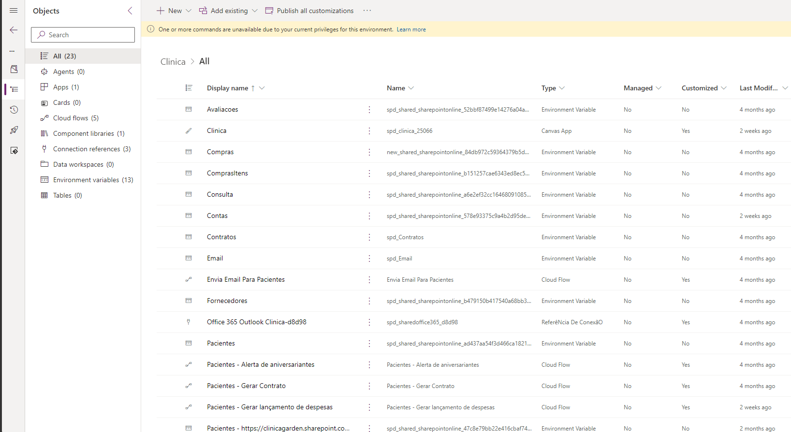
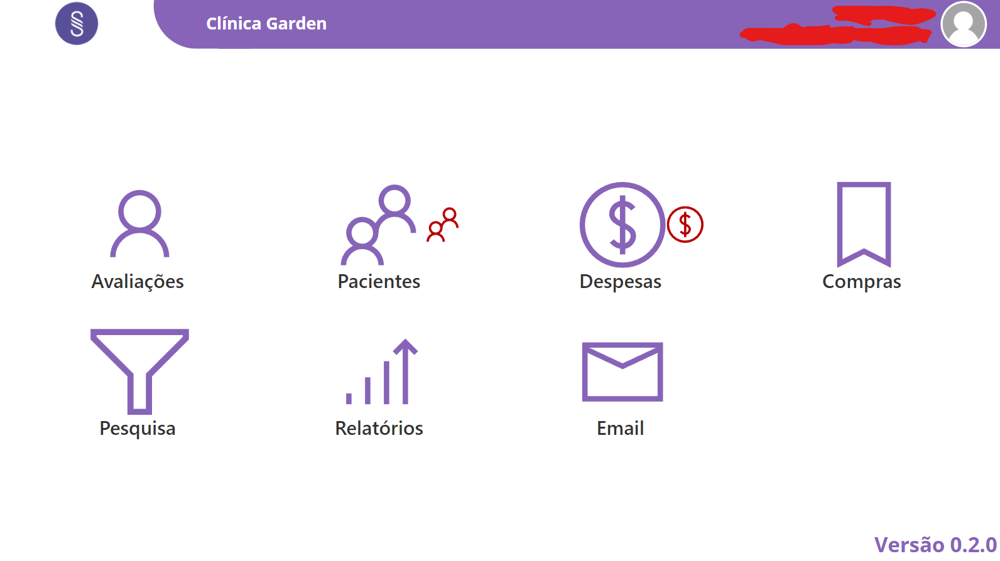

# migracao-projeto-powerplatform
Realizei a migração de um projeto de gestão de clínica desenvolvido com SharePoint Power Apps e Power Automate para um novo tenant

# CENÁRIO ATUAL
O cliente utilizava um tenant e precisava mover esse projeto para um novo tenant

# CENÁRIO DESEJADO
mover o projeto para um novo tenant com um licensiamento mais otimizado

# O QUE FOI FEITO:
Foi criado uma solution para organizar o projeto, e depois o processo de migração começou, utilizando scripts e fluxos do power automate para migrar os dados de todas as listas do projeto do ambiente antigo para o novo e depois migrei o app da clínica.

